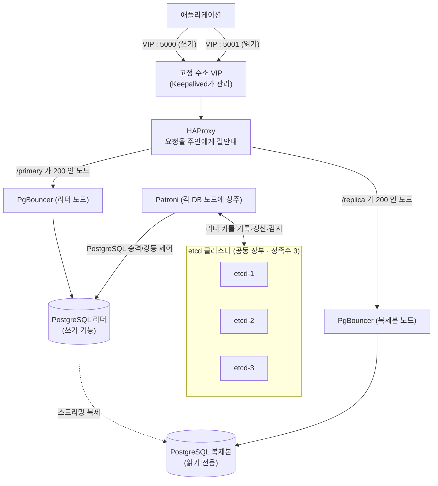
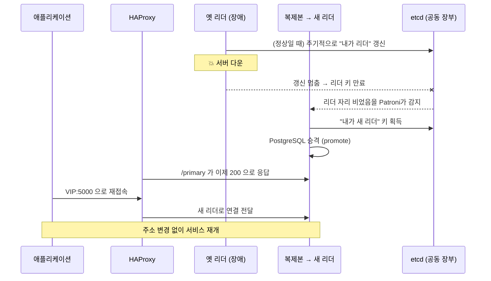
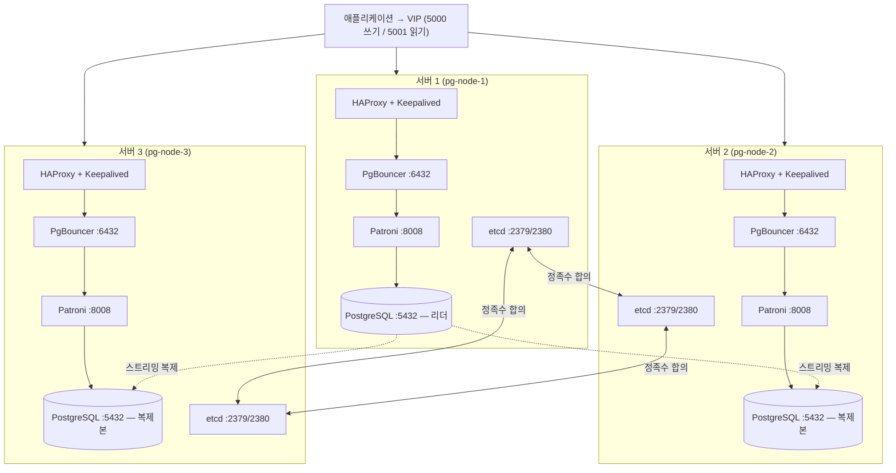
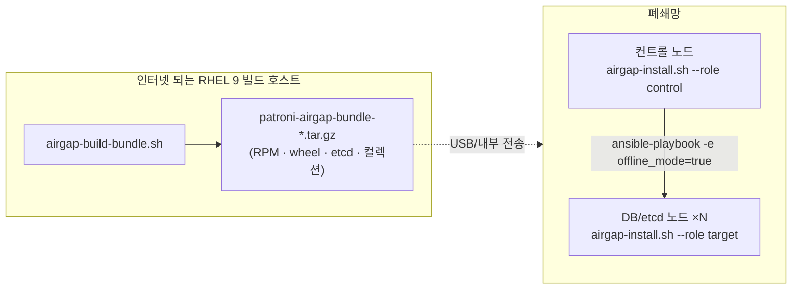

# Patroni로 만드는 PostgreSQL 고가용성(HA) 클러스터

이 문서는 데이터베이스 이중화를 처음 다뤄 보는 분도 끝까지 따라올 수 있도록, 개념부터
실제 배포까지 차근차근 이야기하듯 풀어서 설명합니다. 명령어를 외우기보다 "왜 이렇게 하는가"를
이해하는 데 초점을 맞췄습니다. 천천히 읽어 보시면 좋겠습니다.

---

## 1. 우리가 만들려는 것은 무엇인가

데이터베이스 서버가 한 대뿐이라면, 그 서버가 멈추는 순간 서비스 전체가 멈춥니다. 그래서
우리는 데이터베이스를 여러 대로 늘리고, 그중 한 대가 죽더라도 나머지가 즉시 그 역할을
이어받도록 만들고 싶습니다. 이것을 흔히 **고가용성(High Availability, HA)** 또는 우리말로
**이중화**라고 부릅니다.

그런데 단순히 서버를 여러 대 세운다고 이중화가 완성되지는 않습니다. 다음과 같은 질문에
답할 수 있어야 비로소 "쓸 만한" 이중화가 됩니다.

- 지금 이 순간 **누가 진짜 주인(쓰기를 받는 서버)인가**를 모두가 합의할 수 있는가?
- 주인이 갑자기 죽었을 때, **누가 다음 주인이 될지** 자동으로 정해지는가?
- 애플리케이션은 주인이 바뀌어도 **접속 주소를 바꾸지 않고** 계속 연결할 수 있는가?

이 프로젝트는 위 세 가지 질문에 답하기 위해, 검증된 오픈소스 도구들을 Ansible로 한 번에
설치하고 설정합니다. 사용하는 도구는 다음과 같습니다.

| 도구 | 한 줄 역할 |
|------|-----------|
| **PostgreSQL** | 실제 데이터를 저장하는 데이터베이스 본체 |
| **Patroni** | 누가 주인인지 정하고, 죽으면 자동으로 새 주인을 뽑는 "지휘자" |
| **etcd** | 모두가 함께 들여다보는 "공동 장부". 주인이 누구인지 여기에 기록 |
| **PgBouncer** | 수많은 접속을 모아서 효율적으로 전달하는 "접속 중개소" |
| **HAProxy** | 들어온 요청을 지금의 주인에게 길안내하는 "교통 정리원" |
| **Keepalived** | 고정 접속 주소(VIP)를 살아있는 서버에 붙여 주는 "주소 관리인" |

---

## 2. 전체 개념도

먼저 큰 그림을 봅시다. 애플리케이션이 데이터를 읽고 쓰기 위해 하나의 고정 주소(VIP)에
접속하면, 그 뒤에서 여러 부품이 협력해 항상 살아있는 주인에게 요청을 전달합니다.



이 그림에서 꼭 기억할 점은 두 가지입니다. 첫째, **누가 주인인지는 PostgreSQL끼리 정하지
않고 etcd라는 공동 장부를 통해 정해집니다.** 둘째, **애플리케이션은 주인이 바뀌어도 늘
같은 VIP 주소로만 접속하면 됩니다.** 길안내는 HAProxy가 알아서 해 줍니다.

---

## 3. 장애가 났을 때 어떤 일이 벌어지는가

말로만 "자동 전환"이라고 하면 와닿지 않으니, 리더 서버가 갑자기 죽는 순간을 순서대로
따라가 봅시다.



핵심은 사람이 새벽에 일어나 손으로 조치하지 않아도, 보통 **수 초에서 수십 초 안에** 새
주인이 정해지고 트래픽이 자동으로 옮겨간다는 점입니다.

---

## 4. 왜 하필 Patroni를 추천하는가

PostgreSQL을 이중화하는 방법은 Patroni 말고도 여러 가지가 있습니다. 그런데도 이 프로젝트가
Patroni를 고른 데에는 분명한 이유가 있습니다. 초보자 입장에서 중요한 것부터 풀어 보겠습니다.

- **사람이 손대지 않아도 되는 진짜 자동 페일오버.**
  옛날 방식(예: `repmgr`를 수동으로 운용하거나, 직접 짠 스크립트)은 장애가 났을 때 결국
  사람이 개입해야 하는 경우가 많았습니다. Patroni는 etcd라는 합의 저장소를 심판으로 삼아,
  사람 없이도 안전하게 새 리더를 뽑습니다.

- **"양쪽이 서로 자기가 주인이라 우기는" 사고(split-brain)를 구조적으로 막습니다.**
  이중화에서 가장 무서운 사고는 서버 두 대가 동시에 "내가 주인"이라며 각자 쓰기를 받는
  상황입니다. 데이터가 갈라져 복구가 매우 어려워집니다. Patroni는 etcd의 정족수(과반수
  합의)를 통해 "장부에 리더 키를 가진 단 하나의 노드만 주인"이라는 규칙을 강제하므로,
  이 사고가 구조적으로 일어나기 어렵습니다.

- **설정이 클러스터 전체에 일관되게 적용됩니다.**
  PostgreSQL 설정을 노드마다 따로 고치다 보면 서로 달라져 사고가 납니다. Patroni는 중요한
  설정을 etcd에 한 벌로 저장하고 모든 노드에 동일하게 적용합니다. 설정 변경도
  `patronictl edit-config` 한 번이면 됩니다.

- **운영 도구(`patronictl`)와 상태 확인용 REST API를 기본 제공합니다.**
  "지금 누가 리더지?", "복제 지연은 얼마지?" 같은 질문에 즉시 답할 수 있고, HAProxy 같은
  도구가 이 REST API(`/primary`, `/replica`)로 건강 상태를 물어볼 수 있습니다. 우리 HAProxy
  설정이 바로 이 점을 활용합니다.

- **클라우드 네이티브 환경과 잘 어울리고, 커뮤니티가 활발합니다.**
  쿠버네티스 위의 여러 PostgreSQL 오퍼레이터들도 내부적으로 Patroni를 사용할 만큼 표준에
  가깝게 자리 잡았습니다. 자료가 많아 문제가 생겼을 때 검색으로 해결하기 좋습니다.

정리하면, **"자동이고, 안전하고, 표준적이고, 운영이 편하다"**는 네 가지가 Patroni를 고른
이유입니다.

---

## 5. 소프트웨어 버전 요구사항

버전이 어긋나면 사소한 곳에서 발목을 잡힙니다. 아래 표는 이 플레이북이 검증·권장하는
버전입니다. 대부분 `group_vars/all.yml`에서 바꿀 수 있습니다.

### 제어 노드(Ansible을 실행하는 내 PC/서버)

| 소프트웨어 | 권장 버전 | 비고 |
|-----------|----------|------|
| ansible-core | **2.15 이상** | `assert`, 최신 필터 사용 |
| Python (제어 노드) | 3.9 이상 | Ansible 실행용 |

필요한 Ansible 컬렉션 (`requirements.yml`로 한 번에 설치):

| 컬렉션 | 권장 버전 |
|--------|----------|
| community.general | 8.0 이상 |
| community.postgresql | 3.0 이상 |
| ansible.posix | 1.5 이상 |

### 대상 노드(실제로 클러스터가 깔리는 서버)

| 소프트웨어 | 권장 버전 | 왜 이 버전인가 |
|-----------|----------|----------------|
| **PostgreSQL** | **16** (PGDG 저장소) | `all.yml`의 `postgresql_version`으로 변경 가능 (14·15·17 등) |
| **Patroni** | **3.x** (pip 최신) | Python 3.7 이상 필요. etcd v3 API 지원 |
| **etcd** | **3.5.x** | v3 API 사용. `all.yml`의 `etcd_version` |
| **PgBouncer** | **1.21 이상 권장** | `scram-sha-256` 인증을 온전히 지원하는 버전대 |
| **HAProxy** | **2.x 이상** | `http-check expect status` 문법 사용 |
| **Keepalived** | **2.x 이상** | VRRP 기반 VIP 관리 |
| OS | Debian/Ubuntu 또는 RHEL/Rocky | 양쪽 계열 모두 지원 |
| Python (대상 노드) | 3.9 이상 | Patroni 및 Ansible 모듈 실행 |

> 버전을 바꾸고 싶다면 `group_vars/all.yml`의 `postgresql_version`, `etcd_version` 값을
> 수정하면 됩니다. PgBouncer·HAProxy·Keepalived는 OS 패키지 저장소의 버전을 사용합니다.

---

## 6. 노드를 몇 대로 구성해야 하나

이 질문은 초보자가 가장 많이 헷갈리는 부분이라 따로 떼어 설명합니다. 핵심은 **etcd와
PostgreSQL은 요구 조건이 서로 다르다**는 것입니다.

- **etcd는 "정족수(과반수)"가 생명입니다.** 한 대가 죽어도 과반수가 살아 있어야 장부가
  동작합니다. 그래서 **반드시 홀수, 최소 3대**여야 합니다. 2대는 한 대만 죽어도 과반수가
  깨져 오히려 단일 서버보다 위험합니다. 이 플레이북은 배포 직전 검사(preflight)에서 etcd가
  홀수·3대 이상이 아니면 아예 시작을 막습니다.

- **PostgreSQL(Patroni) 노드는 자기들끼리 투표하지 않습니다.** 주인 결정은 etcd가 하므로
  DB는 **2대(주인 1 + 복제본 1)만으로도 안전하게** 자동 페일오버됩니다. 다만 DB가 2대면
  페일오버 직후 잠시 복제본이 0개가 되어 무방비 상태가 됩니다. **3대로 두면 페일오버
  이후에도 복제본이 남아 이중화가 유지**되고 읽기 부하도 분산할 수 있습니다.

즉, **"안전한 자동 전환"의 최소 조건은 etcd 3대이고, DB는 2대 이상이면 됩니다.** 운영 환경
이라면 DB도 3대를 권장합니다.

---

## 7. 두 가지 구성 방식

이 플레이북은 그룹이 서로 독립적이라, 같은 코드로 두 가지 토폴로지를 모두 만들 수 있습니다.

### 방식 A — 분리형 (기본값: etcd 전용 3대 + DB 2대 이상)

etcd는 가벼우니 작은 전용 서버 3대에 두고, 비싼 DB 서버는 필요한 만큼만 둡니다. DB 라이선스
나 리소스를 아끼면서 정족수를 안전하게 확보하는 방식으로, `inventory/hosts.yml`의 기본값이
바로 이 구성입니다.

### 방식 B — 통합형 (서버 3대에 모든 것을 함께 설치)

서버 3대만으로 단출하게 가고 싶을 때 쓰는 구성입니다. **3대 각각에 etcd, PostgreSQL,
Patroni, PgBouncer, HAProxy, Keepalived를 모두** 올립니다. 가장 보편적이고 자원 효율이
좋은 구성입니다.



이 통합형(방식 B)으로 만들려면 `inventory/hosts.yml`을 아래처럼 작성하면 됩니다. 핵심은
**같은 서버 3대를 etcd 그룹과 patroni_cluster 그룹에 모두 등록**하는 것입니다.

```yaml
all:
  vars:
    ansible_user: root
  children:
    etcd:                      # 3대 모두 etcd 역할 겸함 (정족수 3)
      hosts:
        pg-node-1: { ansible_host: 10.0.0.11, node_ip: 10.0.0.11 }
        pg-node-2: { ansible_host: 10.0.0.12, node_ip: 10.0.0.12 }
        pg-node-3: { ansible_host: 10.0.0.13, node_ip: 10.0.0.13 }

    patroni_cluster:           # 3대 모두 DB 노드
      hosts:
        pg-node-1: { ansible_host: 10.0.0.11, node_ip: 10.0.0.11, patroni_name: pg-node-1 }
        pg-node-2: { ansible_host: 10.0.0.12, node_ip: 10.0.0.12, patroni_name: pg-node-2 }
        pg-node-3: { ansible_host: 10.0.0.13, node_ip: 10.0.0.13, patroni_name: pg-node-3 }

    pgbouncer:                 # DB 노드와 동일
      hosts: { pg-node-1: {}, pg-node-2: {}, pg-node-3: {} }

    haproxy:                   # DB 노드와 동일 + Keepalived 우선순위 부여
      hosts:
        pg-node-1: { keepalived_state: MASTER, keepalived_priority: 110 }
        pg-node-2: { keepalived_state: BACKUP, keepalived_priority: 105 }
        pg-node-3: { keepalived_state: BACKUP, keepalived_priority: 100 }
```

---

## 8. 사전 준비

본격적으로 배포하기 전에 다음을 갖춰 두어야 합니다.

1. **서버 준비.** 방식 A라면 etcd용 3대 + DB용 2대 이상, 방식 B라면 3대. 모든 서버에
   제어 노드에서 **SSH 키로 접속**할 수 있고 **sudo 권한**이 있어야 합니다.

2. **네트워크/방화벽 개방.** 노드 사이에 아래 포트가 열려 있어야 합니다.

   | 포트 | 용도 |
   |------|------|
   | 2379, 2380 | etcd (클라이언트 / 피어) |
   | 5432 | PostgreSQL |
   | 6432 | PgBouncer |
   | 8008 | Patroni REST API (HAProxy 헬스체크) |
   | 5000, 5001 | HAProxy (쓰기 / 읽기) |
   | 7000 | HAProxy 통계 화면 |
   | VRRP (프로토콜 112) | Keepalived VIP 통신 |

3. **제어 노드에 Ansible과 컬렉션 설치.**

   ```bash
   # Ansible 설치(예시)
   python3 -m pip install "ansible-core>=2.15"

   # 이 프로젝트가 쓰는 컬렉션 설치
   ansible-galaxy collection install -r requirements.yml
   ```

---

## 9. 설정 파일 손보기

배포 전에 내 환경에 맞게 몇 군데를 고칩니다. 순서대로 따라오시면 됩니다.

### (1) 인벤토리 — 서버 목록과 IP

`inventory/hosts.yml`을 열어 각 서버의 `ansible_host`와 `node_ip`를 실제 IP로 바꿉니다.
방식 B(통합형)로 가려면 7장의 예시처럼 다시 작성합니다. DB 노드를 늘리고 싶으면 동일한
형식으로 항목만 추가하면 됩니다(파일 안에 주석으로 `pg-node-3` 예시가 들어 있습니다).

### (2) 전역 변수 — VIP, 버전, 튜닝

`group_vars/all.yml`을 열어 최소한 다음 두 가지는 반드시 내 환경에 맞춰야 합니다.

```yaml
cluster_vip: 10.0.0.10     # 애플리케이션이 접속할 고정 주소(아직 아무도 안 쓰는 IP)
vip_interface: eth0        # 그 VIP를 붙일 네트워크 카드 이름 ( `ip a` 로 확인 )
```

### (3) 접속 허용 IP — `pg_hba.conf`

어떤 IP가 PostgreSQL에 접속할 수 있는지를 `postgresql_allowed_cidrs` 목록으로 정합니다.
여기 적은 대역만 접속이 허용됩니다(DB 노드끼리의 복제 접속은 자동 허용되므로 적지 않아도
됩니다).

```yaml
postgresql_auth_method: scram-sha-256
postgresql_allowed_cidrs:
  - 127.0.0.1/32
  - 10.0.0.0/8           # 운영에서는 실제 애플리케이션 IP 대역으로 좁히세요
  # - 203.0.113.25/32    # 특정 서버만 허용하려면 /32 로
```

이 값을 바꾼 뒤 아래 한 줄을 실행하면 **PostgreSQL을 재시작하지 않고 런타임에** 바로
반영됩니다(Patroni가 `pg_hba.conf`를 다시 쓰고 reload).

```bash
ansible-playbook site.yml --tags patroni
```

### (4) 튜닝 프로파일 — 규모에 맞는 `postgresql.conf`

기본값(`postgresql.conf`)은 "프리사이즈 티셔츠"라 어떤 서버에도 딱 맞지 않습니다. 그래서
이 프로젝트는 **DB 서버 RAM 기준**의 규모별 프로파일을 제공합니다. `all.yml`에서 하나만
고르면 됩니다.

```yaml
postgresql_tuning_profile: minimal   # minimal | small | medium | large | xl
```

| 프로파일 | 권장 DB 서버 RAM | `shared_buffers` | `max_connections` | 비고 |
|----------|------------------|------------------|-------------------|------|
| `minimal` | ≤ 4GB (테스트/실습) | 512MB | 200 | **기본값**. 작은 VM에서도 안전 기동 |
| `small`  | 16GB | 4GB  | 200 | 소규모 운영 |
| `medium` | 32GB | 8GB  | 400 | 일반 운영 |
| `large`  | 64GB | 16GB | 600 | 대규모(+ huge_pages) |
| `xl`     | 128GB | 32GB | 800 | 초대규모(+ huge_pages) |

> 이 프로파일 표는 [클러스터 규모별 PostgreSQL 튜닝 가이드](https://www.data-dynamics.io/blog/2026-06-22-cdp-postgresql-tuning-by-cluster-size)를
> 근거로 만들었습니다. 메모리·WAL·autovacuum·로깅·병렬 처리 파라미터가 규모별로 함께
> 잡힙니다. **`shared_buffers`가 큰 프로파일을 RAM이 작은 서버에 적용하면 기동에 실패**하니,
> 반드시 서버 RAM에 맞는 프로파일을 고르세요(잘 모르겠으면 `minimal`로 시작).

**`max_connections`만 따로** 바꾸고 싶다면 프로파일과 무관하게 강제 지정할 수 있습니다.

```yaml
postgresql_max_connections: 500      # 비워두면 프로파일 값을 사용
```

특정 파라미터만 직접 덮어쓰려면 `postgresql_parameters_override`를 쓰세요(가장 높은 우선순위).

```yaml
postgresql_parameters_override:
  shared_buffers: "6GB"
  work_mem: "20MB"
```

> 적용 순서: **공통 base → 선택한 프로파일 → `max_connections` 강제값 → override**.
> 이미 떠 있는 클러스터에 바꾼 튜닝을 적용하는 방법은 13장을 참고하세요.

### (5) 동기 복제 — 데이터 무손실이 필요하다면

기본값은 **비동기 복제**입니다. 리더가 복제본의 응답을 기다리지 않으므로 빠르지만, 리더가
갑자기 죽으면 **아직 복제되지 않은 마지막 몇 건의 트랜잭션이 유실**될 수 있습니다. 돈·주문
처럼 한 건도 잃으면 안 되는 데이터라면 **동기 복제**를 켜세요.

```yaml
patroni_synchronous_mode: true          # 동기 복제 켜기 (기본 false)
patroni_synchronous_mode_strict: false  # 아래 설명 참고
patroni_synchronous_node_count: 1       # 동기적으로 확인받을 standby 개수
```

각 옵션의 의미는 다음과 같습니다.

| 옵션 | 의미 | 트레이드오프 |
|------|------|--------------|
| `patroni_synchronous_mode` | `true` 면 커밋이 동기 standby에 반영될 때까지 리더가 기다림 | 무손실↑ / 쓰기 지연↑ |
| `patroni_synchronous_mode_strict` | `true` 면 동기 standby가 **하나도 없을 때 쓰기를 거부**(무손실 절대 보장) | 일관성↑ / 가용성↓ |
| `patroni_synchronous_node_count` | 동기적으로 확인받을 standby 수(예: 3노드에서 `2`) | 값이 클수록 보장↑ / 지연↑ |

> 핵심 트레이드오프 한 줄: **동기 복제는 "속도"를 내주고 "안전(무손실)"을 얻는** 설정입니다.
> 특히 `strict=true`는 동기 standby가 모두 죽으면 리더가 쓰기를 멈추므로(가용성 희생) 정말
> 무손실이 절대 조건일 때만 켜세요. Patroni가 `synchronous_standby_names`를 자동으로
> 관리하므로 PostgreSQL 쪽 설정을 직접 만질 필요는 없습니다.
>
> ⚠️ 동기 standby가 느리면 리더의 쓰기도 함께 느려집니다. 그래서 `synchronous_node_count`는
> 살아있는 복제본 수보다 작게 두는 것이 안전합니다(3노드면 리더 제외 복제본 2개 중 `1`이 무난).

이미 떠 있는 클러스터에 동기 복제를 켜고 끄는 것은 **재시작 없이** 가능합니다(13장의
`apply-tuning.yml`이 이 설정도 함께 반영합니다).

### (6) 비밀번호 — 반드시 Vault로 암호화

`all.yml`에는 `ChangeMe_...` 형태의 임시 비밀번호가 들어 있습니다. **운영 환경에서는
반드시** 아래처럼 Vault로 암호화한 실제 비밀번호로 교체하세요.

```bash
cp group_vars/vault.yml.example group_vars/vault.yml
# 편집기로 vault.yml 의 값들을 실제 비밀번호로 수정한 뒤
ansible-vault encrypt group_vars/vault.yml
```

---

## 10. 배포하기

이제 준비가 끝났습니다. 배포는 명령어 한 줄입니다.

```bash
# 먼저 서버들과 연결이 되는지 확인
ansible all -m ping

# 전체 클러스터 배포 (Vault를 썼다면 --ask-vault-pass)
ansible-playbook site.yml --ask-vault-pass
```

배포는 다음 순서로 자동 진행됩니다. 각 단계는 태그가 붙어 있어 일부만 다시 실행할 수도
있습니다.

1. **preflight** — etcd가 홀수·3대 이상인지, DB가 2대 이상인지 등을 먼저 검사합니다.
   조건이 안 맞으면 여기서 멈춰, 잘못된 구성으로 배포되는 사고를 막아 줍니다.
2. **common** — 모든 노드에 기본 패키지·시간 동기화·호스트 등록을 설정합니다.
3. **etcd** — 공동 장부 클러스터를 한 대씩 안전하게 띄웁니다.
4. **postgresql** — PostgreSQL 바이너리를 설치합니다(클러스터 초기화는 Patroni가 담당).
5. **patroni** — Patroni를 설치하고 클러스터를 부트스트랩한 뒤, 리더에서 애플리케이션용
   DB와 사용자를 만듭니다.
6. **pgbouncer** — 각 노드에 커넥션 풀러를 올립니다.
7. **haproxy** — HAProxy와 Keepalived(VIP)를 설정합니다.

특정 단계만 실행하고 싶다면 태그를 쓰면 됩니다.

```bash
ansible-playbook site.yml --tags etcd            # etcd 단계만
ansible-playbook site.yml --tags patroni,pgbouncer
ansible-playbook site.yml --limit pg-node-2      # 특정 노드만
```

---

## 11. 잘 됐는지 확인하기

배포가 끝나면 클러스터가 건강한지 봅니다. 아래 운영 플레이북이 `patronictl list` 결과를
보여 줍니다.

```bash
ansible-playbook playbooks/cluster-status.yml
```

또는 아무 DB 노드에 들어가 직접 확인할 수도 있습니다.

```bash
patronictl -c /etc/patroni/patroni.yml list
```

출력에서 한 노드가 `Leader`, 나머지가 `Replica`로 보이고 `Lag`이 작으면 정상입니다.
HAProxy 통계 화면(`http://<노드IP>:7000/`)에서도 어떤 백엔드가 살아있는지 눈으로 볼 수
있습니다.

---

## 12. 애플리케이션에서 접속하기

애플리케이션은 개별 DB 서버 IP가 아니라 **항상 VIP로만** 접속합니다. 그래야 주인이 바뀌어도
접속 설정을 바꿀 필요가 없습니다.

| 용도 | 접속 주소 | 포트 |
|------|-----------|------|
| 읽기/쓰기 (현재 리더) | VIP `10.0.0.10` | `5000` |
| 읽기 전용 (복제본 분산) | VIP `10.0.0.10` | `5001` |

```bash
# 쓰기 연결 예시 (리더로 자동 연결됨)
psql "host=10.0.0.10 port=5000 dbname=appdb user=appuser"
```

> 배포 과정에서 `appuser`(애플리케이션 사용자)가 만들어지고, `appdb`가 **그 사용자를
> 소유자(owner)로** 생성됩니다. 사용자명·DB명·소유 관계는 `all.yml`의 `app_db_*`
> 변수로 바꿀 수 있습니다.

---

## 13. 평소 운영에서 자주 쓰는 작업

```bash
# 클러스터 상태 보기
ansible-playbook playbooks/cluster-status.yml

# 계획된 스위치오버 — 점검 등으로 리더를 일부러 다른 노드로 옮길 때(무중단에 가깝게)
ansible-playbook playbooks/switchover.yml -e target_leader=pg-node-2
```

### 튜닝을 "실행 중인" 클러스터에 적용하기

`all.yml`의 프로파일·`max_connections`·**동기 복제 설정**을 바꾼 뒤, 이미 떠 있는 클러스터에
반영하려면 `apply-tuning.yml`을 실행합니다. 이 플레이북은 `patronictl edit-config`로 etcd에
값을 반영하고 Patroni가 즉시 reload 합니다.

```bash
# all.yml 에 설정한 프로파일/값을 그대로 적용
ansible-playbook playbooks/apply-tuning.yml

# 한 번만 다른 값으로 적용해 보기 (명령행에서 덮어쓰기)
ansible-playbook playbooks/apply-tuning.yml -e postgresql_tuning_profile=medium
ansible-playbook playbooks/apply-tuning.yml -e postgresql_max_connections=500

# 동기 복제를 재시작 없이 켜기 (끄려면 false)
ansible-playbook playbooks/apply-tuning.yml -e patroni_synchronous_mode=true
```

여기서 한 가지 중요한 점. **모든 파라미터가 reload만으로 적용되지는 않습니다.**

- **reload로 즉시 적용**: `work_mem`, `effective_cache_size`, `random_page_cost`,
  autovacuum·로깅 관련 등 → `apply-tuning.yml`만으로 끝.
- **재시작(restart)이 필요**: `shared_buffers`, `max_connections`, `wal_buffers`,
  `huge_pages`, `max_worker_processes` 등. 이 값들을 바꾸면 `patronictl list`의
  **`Pending restart`** 열에 표시되며, 아래 재시작 플레이북을 한 번 더 실행해야 합니다.

### PostgreSQL 재시작하기 (롤링)

```bash
# 복제본 먼저 → 리더 마지막 순서로 안전하게 롤링 재시작
ansible-playbook playbooks/restart-postgresql.yml

# 'Pending restart' 표시된 노드만 재시작
ansible-playbook playbooks/restart-postgresql.yml -e only_pending=true

# 튜닝 적용과 재시작을 한 번에 (재시작 필요한 값을 바꿨을 때 편리)
ansible-playbook playbooks/apply-tuning.yml -e restart_after_apply=true
```

### 노드에 직접 들어가서 쓰는 명령들

```bash
patronictl -c /etc/patroni/patroni.yml list            # 상태 확인
patronictl -c /etc/patroni/patroni.yml failover         # 비상 페일오버(수동)
patronictl -c /etc/patroni/patroni.yml restart <클러스터> <노드>   # 특정 노드 재시작
patronictl -c /etc/patroni/patroni.yml edit-config      # 클러스터 공통 설정 변경
```

> 참고: PostgreSQL의 클러스터 공통 설정(메모리, WAL 등)은 노드의 `patroni.yml`을 직접
> 고치는 게 아니라 `patronictl edit-config`(= `apply-tuning.yml`)로 바꿉니다. 그래야
> 모든 노드에 일관되게 반영됩니다.

---

## 14. 트러블슈팅

배포나 운영 중 자주 마주치는 문제와 원인을 증상별로 정리했습니다. 대부분은 "어디를 먼저
봐야 하는가"만 알면 빠르게 풀립니다. 가장 먼저 보는 곳은 **`patronictl list`** 와
**`journalctl -u patroni`** 입니다.

### 리더가 선출되지 않는다 / `patronictl list`가 비어 있다

거의 항상 **etcd 문제**입니다. Patroni는 etcd에 리더 키를 쓰지 못하면 아무도 리더가 될 수
없습니다.

```bash
# etcd 상태와 멤버 확인 (DB 노드에서)
ETCDCTL_API=3 etcdctl --endpoints=http://127.0.0.1:2379 endpoint health
ETCDCTL_API=3 etcdctl --endpoints=http://127.0.0.1:2379 member list
journalctl -u etcd -n 50 --no-pager
```

- etcd가 **정족수(과반수)** 를 잃지 않았는지 확인하세요. 3대 중 2대 이상 살아 있어야 합니다.
- 노드 간 시간이 어긋나면 리스(lease) 만료 판단이 틀어집니다 → `chronyc tracking`으로 확인.
- 방화벽에서 `2379`, `2380` 포트가 막혔는지 확인.

### Patroni 서비스가 기동하지 않는다

```bash
journalctl -u patroni -n 80 --no-pager
sudo -u postgres patroni --validate-config /etc/patroni/patroni.yml
```

- **`shared_buffers`가 서버 RAM보다 크게 잡힌 경우** PostgreSQL이 아예 못 뜹니다. 9장의
  튜닝 프로파일을 서버 RAM에 맞게 낮추세요(`minimal`로 내려서 확인).
- `bin_dir` 경로가 실제 설치 경로와 다른지 확인(`all.yml`의 `postgresql_bin_dir_*`).
- 데이터 디렉터리 권한이 `postgres:postgres` / `0700`인지 확인.

### 복제본이 따라오지 못한다 (Lag이 계속 커진다)

```bash
patronictl -c /etc/patroni/patroni.yml list      # Lag 열 확인
# 리더에서 복제 상태 확인
psql -U postgres -c "SELECT client_addr, state, sync_state, replay_lag FROM pg_stat_replication;"
```

- 복제본 디스크 I/O나 네트워크 대역이 부족하지 않은지 확인.
- WAL이 부족해 복제가 끊겼다면 `max_wal_size`·`wal_keep_size`를 키우세요(프로파일 상향).
- 망가진 복제본은 `patronictl reinit <클러스터> <노드>`로 리더에서 다시 복제받게 합니다.

### 접속이 거부된다 (`no pg_hba.conf entry` 오류)

클라이언트 IP가 `postgresql_allowed_cidrs`에 없기 때문입니다.

```bash
# 현재 적용된 규칙 확인
psql -U postgres -c "SELECT type, database, user_name, address, auth_method FROM pg_hba_file_rules;"
```

- `all.yml`의 `postgresql_allowed_cidrs`에 클라이언트 대역을 추가하고
  `ansible-playbook site.yml --tags patroni`를 실행하면 재시작 없이 반영됩니다(9장 참고).
- 비밀번호 인증 실패라면 `postgresql_auth_method`(기본 `scram-sha-256`)와 클라이언트
  드라이버가 SCRAM을 지원하는지 확인.

### VIP로 접속이 안 된다 / 페일오버 후 연결이 안 옮겨간다

```bash
ip a | grep {{ '<VIP>' }}                          # VIP가 어느 노드에 붙어 있는지
systemctl status haproxy keepalived              # 두 서비스 상태
curl -s http://127.0.0.1:7000/                   # HAProxy 통계 화면(텍스트)
```

- VIP가 어느 노드에도 없으면 Keepalived 문제입니다 → `journalctl -u keepalived`.
- `all.yml`의 `vip_interface`가 실제 NIC 이름과 같은지 확인(`ip a`).
- HAProxy가 리더를 못 찾으면 Patroni REST(`8008`) 헬스체크 경로를 확인:
  `curl -s http://<노드>:8008/primary` (리더면 200).

### `max_connections`를 늘렸는데 적용이 안 된다

`max_connections`는 **재시작이 필요한** 파라미터입니다. `apply-tuning.yml`로 값만 바꾸면
`Pending restart`로 표시될 뿐 적용되지 않습니다 → `restart-postgresql.yml`을 실행하세요
(13장). 적용 확인:

```bash
psql -U postgres -c "SHOW max_connections;"
psql -U postgres -c "SELECT name, setting, pending_restart FROM pg_settings WHERE name='max_connections';"
```

### 동기 복제를 켰더니 쓰기가 멈추거나 매우 느려진다

`patroni_synchronous_mode=true`(특히 `strict=true`)에서, 동기 standby가 부족하면 리더가
커밋을 확정하지 못해 쓰기가 대기합니다.

```bash
# 현재 동기 standby 가 누구인지 / 동기 설정 확인
psql -U postgres -c "SHOW synchronous_standby_names;"
psql -U postgres -c "SELECT application_name, sync_state FROM pg_stat_replication;"
patronictl -c /etc/patroni/patroni.yml list   # Sync Standby 표시 확인
```

- `synchronous_node_count`가 살아있는 복제본 수보다 크면 절대 충족될 수 없습니다 → 값을 낮추세요.
- 복제본이 느리거나 끊긴 경우(앞의 "복제본이 따라오지 못한다" 참고)에도 발생합니다.
- 무손실보다 가용성이 급하면 `strict`를 끄거나, 동기 복제를 잠시 꺼서 비동기로 전환:
  `ansible-playbook playbooks/apply-tuning.yml -e patroni_synchronous_mode=false`

### 튜닝이 "정말 먹혔는지" 확인하는 쿼리

```sql
-- 값이 실제로 적용됐나
SELECT name, setting, unit, source, pending_restart
FROM pg_settings
WHERE name IN ('shared_buffers','work_mem','max_connections','max_wal_size','random_page_cost');

-- 체크포인트가 너무 잦지 않나 (checkpoints_req 가 크면 max_wal_size 를 키울 신호)
SELECT checkpoints_timed, checkpoints_req FROM pg_stat_bgwriter;

-- 현재 커넥션이 max_connections 에 근접하나
SELECT count(*) AS conns, current_setting('max_connections') AS max FROM pg_stat_activity;
```

---

## 15. 보안 체크리스트

마지막으로, 운영에 올리기 전 반드시 확인할 것들입니다.

- `group_vars/all.yml`의 `ChangeMe_...` 비밀번호를 **모두** Vault 값으로 교체했는가?
- `patroni.yml`의 `pg_hba` 규칙에서 `0.0.0.0/0`을 **실제 애플리케이션 IP 대역**으로
  좁혔는가?
- etcd, Patroni REST, 노드 간 복제 트래픽에 **TLS 적용**을 검토했는가?
- `vault.yml`이 `.gitignore`에 의해 저장소에 올라가지 않는지 확인했는가?

---

## 16. 디렉터리 구조

```
.
├── ansible.cfg              # Ansible 기본 동작 설정
├── site.yml                 # 메인 플레이북(여기서 모든 역할을 순서대로 실행)
├── requirements.yml         # 필요한 Ansible 컬렉션 목록
├── inventory/
│   └── hosts.yml            # 서버 목록과 그룹(토폴로지를 여기서 정의)
├── group_vars/
│   ├── all.yml              # 전역 변수(버전·VIP·튜닝 프로파일·접근 IP·임시 비밀번호)
│   └── vault.yml.example    # 운영용 비밀번호 템플릿(복사 후 암호화)
├── playbooks/
│   ├── cluster-status.yml   # 클러스터 상태 확인
│   ├── switchover.yml       # 계획된 리더 전환
│   ├── apply-tuning.yml     # 튜닝 파라미터를 실행 중 클러스터에 적용(edit-config)
│   ├── restart-postgresql.yml  # PostgreSQL 롤링 재시작(복제본→리더)
│   └── templates/
│       └── dynamic-tuning.yml.j2   # edit-config 로 넘길 동적 설정 패치
├── scripts/
│   ├── airgap-build-bundle.sh  # 폐쇄망 설치 번들 빌드(인터넷 호스트에서)
│   └── airgap-install.sh       # 폐쇄망 각 노드에 오프라인 설치
└── roles/
    ├── common/              # 공통 기본 설정
    ├── etcd/                # etcd(공동 장부)
    ├── postgresql/          # PostgreSQL 바이너리 설치
    ├── patroni/             # Patroni + 클러스터 부트스트랩
    ├── pgbouncer/           # 커넥션 풀러
    └── haproxy/             # HAProxy + Keepalived(VIP)
```

여기까지 따라오셨다면, 이제 한 대가 죽어도 스스로 일어서는 PostgreSQL 클러스터를 손에
넣으신 겁니다. 천천히, 한 단계씩 실습해 보시길 권합니다.

---

## 부록 A. 폐쇄망(air-gap) 설치 — RHEL 9 / Python 3.9

인터넷이 차단된 환경(금융·공공·내부망)에서는 노드들이 외부 저장소나 GitHub, PyPI에 접속할
수 없습니다. 그래서 **인터넷이 되는 곳에서 필요한 모든 설치 파일을 미리 모아 두고**, 그
꾸러미(번들)를 폐쇄망으로 옮겨 설치합니다. 이 프로젝트는 RHEL 9의 시스템 Python 3.9을
기준으로 이 과정을 두 개의 스크립트로 자동화합니다.

> **버전 호환 주의:** RHEL 9의 시스템 Python은 **3.9**입니다. `ansible-core 2.16` 이상은
> 컨트롤 노드에 **Python 3.10+** 를 요구하므로, 이 환경에서는 `ansible-core 2.15.x`를
> 사용해야 합니다. 번들 빌드 스크립트가 이 범위(`>=2.15,<2.16`)로 고정해 받습니다.

### 전체 그림



### 1단계 — 번들 만들기 (인터넷 되는 RHEL 9 호스트)

빌드 호스트에는 BaseOS/AppStream, **EPEL**, **PGDG**(PostgreSQL) 저장소가 활성화되어 있어야
합니다(`postgresql16-server`, `pgbouncer` 등을 받기 위함).

```bash
# 버전은 group_vars/all.yml 과 맞추세요(기본 PG16, etcd 3.5.16)
./scripts/airgap-build-bundle.sh
# 또는 버전 지정
PG_VER=16 ETCD_VER=3.5.16 ./scripts/airgap-build-bundle.sh
```

스크립트가 하는 일:

1. **RPM** — 의존성까지(`--resolve --alldeps`) 모아 `createrepo_c`로 로컬 저장소 메타데이터 생성
2. **pip wheel** — 컨트롤용(`ansible-core 2.15.x`)과 대상용(`patroni[etcd3]`,
   `psycopg2-binary`, `python-etcd`)을 각각 다운로드 (RHEL 9/py3.9에서 받으므로 호환)
3. **etcd** 바이너리 tarball 다운로드
4. **Ansible 컬렉션** (`community.general`·`community.postgresql`·`ansible.posix`) 다운로드
5. 위 전체와 `airgap-install.sh`·매니페스트를 `patroni-airgap-bundle-*.tar.gz` 로 묶기

### 2단계 — 번들 옮기기

생성된 `patroni-airgap-bundle-*.tar.gz` 를 폐쇄망의 **컨트롤 노드와 모든 대상 노드**로
복사한 뒤 각 노드에서 풉니다.

```bash
tar xzf patroni-airgap-bundle-*.tar.gz && cd airgap-bundle
```

### 3단계 — 노드별 오프라인 설치

```bash
# 컨트롤 노드: Python 3.9 venv 에 ansible-core + 컬렉션(오프라인) 설치
sudo ./airgap-install.sh --role control

# 각 DB/etcd 노드: 로컬 dnf 저장소 + wheelhouse + etcd 바이너리 배치
sudo ./airgap-install.sh --role target

# 한 노드가 컨트롤 겸 대상이면(통합형)
sudo ./airgap-install.sh --role both
```

설치 스크립트는 각 노드에 다음을 배치합니다(경로는 `all.yml`의 `offline_*` 와 일치).

| 자원 | 위치 | 용도 |
|------|------|------|
| 로컬 dnf 저장소 | `/etc/yum.repos.d/patroni-airgap.repo` → `/opt/patroni-airgap/rpms` | 패키지 오프라인 설치 |
| pip wheelhouse | `/opt/patroni-airgap/wheels` | Patroni 등 오프라인 설치 |
| etcd 바이너리 | `/opt/patroni-airgap/etcd/` | etcd 오프라인 설치 |
| ansible venv | `/opt/patroni-airgap/venv` (컨트롤만) | 폐쇄망에서 playbook 실행 |

### 4단계 — `offline_mode`로 배포

컨트롤 노드에서 venv를 활성화하고, **`offline_mode=true`** 로 평소처럼 배포합니다. 이 값이
켜지면 roles가 인터넷 작업(PGDG 저장소 추가, etcd 다운로드, pip 인터넷 설치)을 건너뛰고
위에서 배치한 로컬 자원만 사용합니다.

```bash
source /opt/patroni-airgap/venv/bin/activate
ansible all -m ping
ansible-playbook site.yml -e offline_mode=true --ask-vault-pass
```

> `offline_mode`를 매번 `-e`로 주기 번거롭다면 `group_vars/all.yml`에서
> `offline_mode: true` 로 고정해도 됩니다. 그러면 `ansible-playbook site.yml` 만으로
> 폐쇄망 설치가 진행됩니다.

### 동작 원리 요약

`offline_mode: true`일 때 각 역할의 차이는 다음과 같습니다.

| 역할 | 온라인(기본) | 폐쇄망(offline_mode) |
|------|--------------|----------------------|
| common / postgresql / pgbouncer / haproxy | 시스템·PGDG 저장소에서 dnf 설치 | `--disablerepo='*' --enablerepo=patroni-airgap` 로컬 저장소만 사용 |
| postgresql | PGDG 저장소 RPM 추가 + 모듈 비활성화 | 건너뜀(로컬 저장소가 패키지 제공) |
| etcd | GitHub에서 tarball 다운로드 | `offline_etcd_tarball` 로컬 파일 사용 |
| patroni | PyPI에서 pip 설치 | `pip --no-index --find-links <wheelhouse>` |
